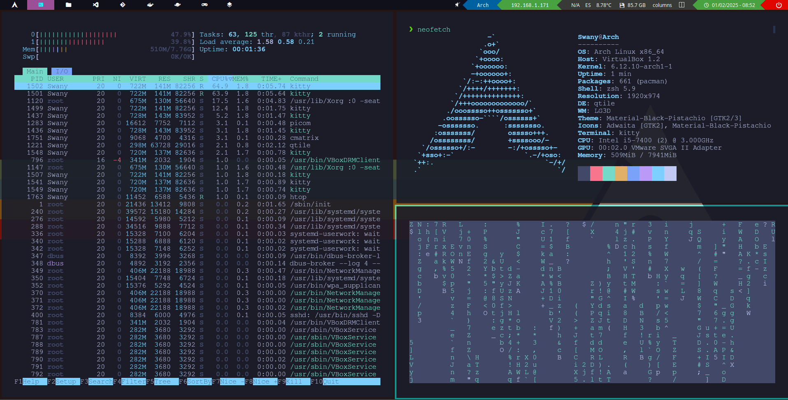

# Dotfiles 
My Arch Linux Dotfiles &amp; Config

## Qtile 

## Cinnamon 

- Proximament

## Repositoris i Recursos que he emprat

Per crear el meu propi entorn d'escritori m'he basat principalment amb els següents dos cursos. El d'en s4vitar sobretot per la configuració de la terminal y la polybar i n'Antonio Sarosi per l'entorn d'escritori i el sistema gestor de finestres. A més he vist més videos que us deixaré abaix. També m'he inspirat amb altres entorns d'escriptori com Arch Craft OS i Awesome.

### Guies que he seguit principalment

[s4vitar: ASÍ es el ENTORNO de un HACKER](https://www.youtube.com/watch?v=fshLf6u8B-w&list=PLAmFGtb2oqjVBq-umQ1MRF4mqYvUYy67g)

[Antonio Sarosi: Creando tu propio entorno de escritorio en Arch](https://mastermind.ac/curso/creando-tu-propio-entorno-de-escritorio-en-arch)

### Altres

- [Cinnamon Desktop Install on BlackArch Linux](https://www.youtube.com/watch?v=mwHzOghuvyM&t=3s)
- [Install Cosmic Desktop on Arch Linux - Epoch 1 Impression (2024)](https://www.youtube.com/watch?v=UzgA3Aidrd0)
- [¿Es realmente DIFÍCIL Arch Linux?](https://www.youtube.com/watch?v=bLXx0pkONec)
- [How to install Guest Additions on Arch Linux in VirtualBox](https://www.youtube.com/watch?v=4LwQ4gokcVA&t=1s)
- [¿Por qué me he pasado a Arch? Lo que va bien y lo que va mal](https://www.youtube.com/watch?v=gFO99L4kzNg&t=611s)
- [CONVIERTE TU LINUX EN UN ENTORNO PROFESIONAL DE TRABAJO (2021)](https://www.youtube.com/watch?v=mHLwfI1nHHY)
- [Configurar ENTORNO PROFESIONAL de HACKING y CIBERSEGURIDAD con Bspwm](https://www.youtube.com/watch?v=7o7JqeToFzg)
- [Como instalar y configuar Polybar](https://www.youtube.com/watch?v=mRY5qisOBhk)

### Repositoris

- https://github.com/jorgeloopzz/dotfiles
- https://github.com/gh0stzk/dotfiles
- https://github.com/archcraft-os/archcraft
- https://github.com/Alpharivs/dotfiles
- https://github.com/antoniosarosi/dotfiles
